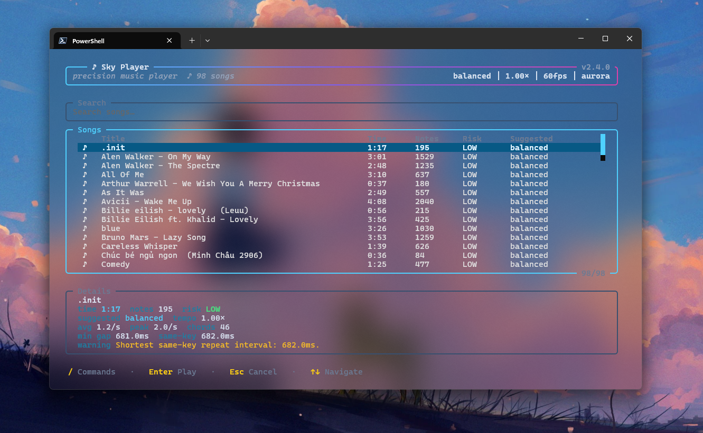

# 🎵 Sky Auto Player

*Auto-plays Sky music sheets on Windows, in time.*

**[🌐 Landing page](https://pumni.github.io/Sky-Player/)** · **[FAQ](https://pumni.github.io/Sky-Player/faq.html)** · **[Download](https://github.com/pumni/Sky-Player/releases/latest)**

  

---

Sky Player turns song sheets from the [specy/skyMusic](https://specy.github.io/skyMusic/)
editor into clean chords, fast arpeggios, and long holds played in-game, automatically. It
sends standard keystrokes through the public Windows `SendInput` API — the same channel any
keyboard macro uses — and never reads game memory, injects code, hooks the process, attaches a
debugger, or touches game files.

> [!WARNING]
> Automated music playback may violate Thatgamecompany's Terms of Service. Use this tool
> responsibly and at your own risk.

---

## Quick start

**Requirements:** Windows 10 or 11 (64-bit). The packaged build ships its own Python — no
system Python, no installer, no admin rights, no registry entries.

1. Download `Sky-Player-v<latest>.zip` from the
   [latest release](https://github.com/pumni/Sky-Player/releases/latest).
2. Extract it anywhere — e.g. `C:\Sky-Player\`.
3. Run `Sky-Player.exe`.

### Add a song

1. Open the [Sky Music Nightly editor](https://specy.github.io/skyMusic/).
2. Export a song as **JSON**, **skysheet**, or JSON-compatible **txt**.
3. Drop the file into the `songs/` folder next to `Sky-Player.exe`.
4. Press `Ctrl+R` in the picker to reload.

---

## Features

- **Textual TUI picker** — fuzzy search by song name, fully keyboard-driven
- **Per-song profiles** — timing, tempo, FPS, theme
- **Dry-run mode** — preview without sending input
- **Live HUD** — timing jitter and dispatch health at a glance
- **Tuning presets** — for weak PCs, the free-threaded `python3.14t` interpreter, and more
- **Hotkeys** — `/` command palette · `F8` pause · `F9` skip · `F10` stop · `q` / `Esc` quit

---

## Updating

Sky Player checks GitHub for new releases and shows a banner when one is available. **It never
self-updates while running** — applying an update is one explicit step:

1. Close Sky Player.
2. Run `updater.bat` in the install folder.
3. Reopen `Sky-Player.exe`.

The updater verifies SHA256 before touching any file, rolls back failed copies transactionally,
and never replaces your `config.json` or `songs/` folder. Pre-release builds:
`updater.bat -Channel beta`.

---

## FAQ

<b>Will this get me banned?</b>

It sends only standard keyboard input and never touches the game — no memory reads, no hooks,
no code injection, no file modification. That is the same channel any keyboard macro uses.
Automated playback may still conflict with Sky's Terms of Service, however, so use it
responsibly and at your own risk.

<b>Does it run on macOS or Linux?</b>

No. Sky Player depends on Windows-specific APIs — `SendInput` for input simulation and MMCSS for
real-time thread scheduling. macOS and Linux are not on the roadmap.

<b>Can I build it from source?</b>

Yes. Clone the repo, run `uv sync` to set up the Python 3.14 free-threaded environment, then
launch with `uv run python src/main.py`. Run `--doctor` to verify your GIL state, MMCSS
availability, and key mapping, and see [docs/tuning-presets.md](docs/tuning-presets.md) for
non-standard environment presets.

The full FAQ — 14 questions covering file formats, troubleshooting, the update mechanism, and
the security model — lives at **<https://pumni.github.io/Sky-Player/faq.html>**.

---

## Support

If Sky Player has saved your wrist, leave a star — it helps other players find the tool. Bug
reports and ideas go to [GitHub Issues](https://github.com/pumni/Sky-Player/issues). To support
development directly:

---

## License

[GNU General Public License v3.0](LICENSE) · © pumni
