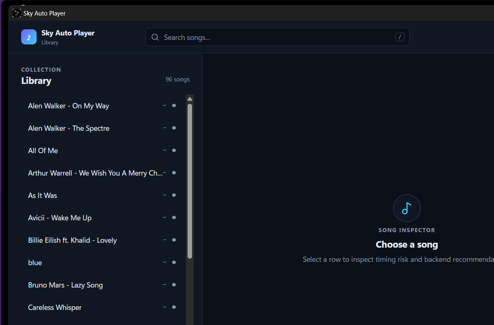

<div align="center">


# Sky Auto Player

*Auto-plays Sky music sheets on Windows — notes, chords, and holds land on the beat with sub-millisecond native precision.*

[](https://github.com/pumni/Sky-Auto-Player-Releases/releases/latest)
[](https://github.com/pumni/Sky-Auto-Player-Releases/releases)
[](https://github.com/pumni/Sky-Auto-Player/blob/main/LICENSE)
[](https://github.com/pumni/Sky-Auto-Player/stargazers)

**[🌐 Landing Page](https://pumni.github.io/Sky-Auto-Player/)** · **[FAQ](https://pumni.github.io/Sky-Auto-Player/faq/)** · **[Download Latest](https://github.com/pumni/Sky-Auto-Player-Releases/releases/latest)**

</div>

<div align="center">
  <a href="docs/evidence/desktop-nonphysical/library-real-tauri.png" target="_blank">
    
  </a>
</div>

The packaged `Sky-Auto-Player.exe` opens the canonical Tauri desktop GUI. It is the only supported
user-facing application and runs entirely on the native Rust desktop runtime.

---

**Sky Auto Player** transforms song sheets from the [specy/skyMusic](https://specy.github.io/skyMusic/) editor into clean chords, rapid arpeggios, and expressive holds played in-game with microsecond-level timing accuracy.

The application uses a **high-performance native architecture**:
- 🦀 **Native Rust Real-Time Core (`sky_player`)** — Dedicated RT worker handling timeline compilation, absolute QPC scheduling, MMCSS thread priority, sub-millisecond spin-wait, focus gating, and safe input dispatch.
- 🖥️ **Tauri 2 + React/TypeScript desktop GUI** — The canonical packaged interface for Library, Song Detail, Player Dock, Diagnostics, Settings, and Updates.

Keystrokes are submitted solely through the public Windows `SendInput` API — the exact same channel used by standard keyboard macros. Sky Auto Player **never** reads game memory, injects DLLs, hooks processes, attaches debuggers, or tampers with game files.

## Why it sounds right

Sky Auto Player doesn't replay a coarse macro timer. It schedules every note like a precision musical performance:

- **Contiguous chord batches** — Chord notes are submitted in a single `SendInput` batch to minimize sender-side skew.
- **Sub-millisecond native timing** — Unshifted absolute QPC target scheduling with precision spin-wait and Windows MMCSS (`Games/Pro Audio`) registration.
- **Holds keep their full duration** — Long notes are never clipped short, even when subsequent notes follow in rapid succession.
- **Explicit hold-frame timing** — Select exact game frame holds (`1.0`, `1.25`, or `1.5` frames) tailored to the in-game FPS configuration.
- **Calibrated transport margins** — Sender-side hold shrink is calibrated and proven during admission to safeguard physical hold floors.
- **Zero runtime Python dependency** — the packaged desktop runs without a Python interpreter or extension module.

> [!WARNING]
> Automated music playback may violate Thatgamecompany's Terms of Service. Use this tool responsibly and at your own risk.

---

## Quick Start

**Requirements:** Windows 10 or 11 (64-bit). The canonical build is a per-user Tauri NSIS installer; it does not require administrator rights for installation. No system Python or Rust toolchain is required at runtime.

1. Download the canonical Tauri NSIS installer from the [dedicated v4 release authority](https://github.com/pumni/Sky-Auto-Player-Releases/releases).
2. Run the installer and keep the default current-user install location.
3. Launch **Sky Auto Player** from the Start menu or installed shortcut.

### Adding Songs

1. Open the [Sky Music Nightly editor](https://specy.github.io/skyMusic/).
2. Export a song as **JSON**, **skysheet**, or JSON-compatible **txt**.
3. Import the file through the desktop Library.
4. In the desktop Library, press **Reload songs**.

---

## Features

- ⚡ **Native Rust Dispatch Core** — Absolute QPC scheduling with MMCSS audio priority and zero GC/GIL pauses
- 🎹 **Timing-first playback** — Contiguous chord batching, full hold preservation, and verified release gaps
- 🖥️ **Modern Tauri desktop GUI** — Library search, Song Detail, Player Dock, Diagnostics, Settings, and Updates
- 🎛️ **Per-song configuration** — Customizable hold profile, tempo multiplier, target FPS, and visual themes
- 🛡️ **Fail-safe controls** — Real-time focus loss detection, auto-pause, and immediate all-up key release
- 🔍 **Dry-run mode** — Preview playback rhythm in the HUD without sending keyboard input
- ⌨️ **Desktop shortcuts** — `/` or `Ctrl+F` focuses search · `Esc` closes safe overlays · `q` does not quit the GUI

---

## Updating

Sky Auto Player checks the configured v4 channel through the dedicated release authority and displays a notification banner when an update is available.

Selecting **Update and Restart** uses the official Tauri updater through the Rust-owned `UpdateService`. It verifies the Tauri updater signature over the exact NSIS update artifact, then runs the current-user installer. The v4 product does not bundle `Sky-Auto-Player-Updater.exe`, use a portable ZIP updater, or use the retired v3 `MANIFEST.json.sig` contract.

> [!WARNING]
> Download v4 installers only from the dedicated [v4 release authority](https://github.com/pumni/Sky-Auto-Player-Releases/releases). Canonical Windows artifacts are Authenticode-qualified; the installer and Tauri `.sig` sidecar are verified as exact release bytes during qualification.

---

## FAQ

<details>
<summary><b>Will this get me banned?</b></summary>

It sends standard keyboard input only and never touches the game process — no memory reading, no hooking, no DLL injection, and no file modification. This is identical to the mechanism used by physical programmable keyboards and macro utilities. However, automated playback may still conflict with Sky's Terms of Service, so use it responsibly and at your own risk.
</details>

<details>
<summary><b>Does it run on macOS or Linux?</b></summary>

No. Sky Auto Player depends on Windows-specific system APIs — `SendInput` for input dispatch and MMCSS / QPC for real-time thread scheduling. macOS and Linux are not supported.
</details>

<details>
<summary><b>Can I build it from source?</b></summary>

Yes. Prerequisites: Windows 10/11, [Bun](https://bun.sh/), and the Rust toolchain (pinned in `rust/rust-toolchain.toml`). The canonical product checks and Tauri NSIS package use Rust and Bun only.

```powershell
# 1. Clone repository
git clone https://github.com/pumni/Sky-Auto-Player.git
cd Sky-Auto-Player

# 2. Install frontend dependencies
cd desktop
bun install --frozen-lockfile
cd ..

# 3. Run repository verification
cargo xtask check all

# 4. Build the canonical Tauri NSIS package (use the test-signing context
#    described in docs/v4-tauri-packaging.md)
cd desktop
bun run tauri build --ci -- --profile dist
```
</details>

The complete FAQ — covering supported file formats, troubleshooting, timing architecture, and the security model — is available at **<https://pumni.github.io/Sky-Auto-Player/faq/>**.

---

## Support

If Sky Auto Player has helped your musical journey, consider giving the project a star ⭐ on GitHub! For bug reports, feature suggestions, or questions, please open an issue on [GitHub Issues](https://github.com/pumni/Sky-Auto-Player/issues).

<div align="center">
  <a href="https://ko-fi.com/pumni">
    
  </a>
</div>

---

## License

[GNU General Public License v3.0](LICENSE) · © [pumni](https://github.com/pumni)
