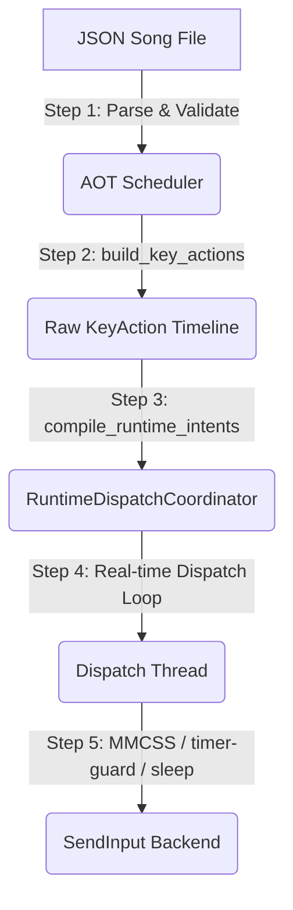

# System Architecture & Calibration

Sky Player is built on a modern, strictly-layered **Domain-Driven Design (DDD)**. The architecture separates the abstract concept of music from the harsh, real-time realities of OS thread scheduling and game engine polling constraints.

---

## 1. High-Level Architecture

The codebase is divided into four distinct layers:

1. **Domain (`sky_music/domain/`):** Pure Python, zero side-effects. Contains immutable models (`Song`, `Note`), the strict JSON parser, and the Ahead-Of-Time (AOT) microsecond [scheduler](file:///d:/Dev/Sky%20Player/src/sky_music/domain/scheduler.py).
2. **Orchestration (`sky_music/orchestration/`):** The real-time heart of the app. Contains the `PlaybackEngine` (which consumes the timeline), the [RuntimeDispatchCoordinator](file:///d:/Dev/Sky%20Player/src/sky_music/orchestration/runtime_dispatch.py#L133) (which manages key generations and anchor timing), and the telemetry/calibration modules.
3. **Infrastructure (`sky_music/infrastructure/`):** Bridging code. Includes window focus tracking, hotkey listeners, real-time sleeper utilities, and MMCSS registrations.
4. **Platform (`sky_music/platform/win32/`):** OS-specific implementations. Translates abstract actions into `SendInput` API calls using physical hardware scan codes.

---

## 2. The Playback Pipeline

The journey from a JSON file to a piano sound in-game follows a strict pipeline:



### Step 1: Parsing & Resolution
The parser reads the JSON file, strictly validating timestamps and schemas. Unmapped keys or negative timestamps instantly halt execution with clear errors. Keys are resolved into physical **Scan Codes** (ignoring OS keyboard language layouts).

### Step 2: The AOT Scheduler (`build_key_actions`)
Instead of calculating delays on the fly, the entire song is mapped out onto an absolute timeline in **microseconds** *before* playback begins.
* **Tempo Scaling:** All timestamps are scaled by `tempo_scale` and converted to microseconds.
* **Visibility Hold (`min_hold_us`):** Each note is held down long enough to survive the game's per-frame input sampling. With FPS selected, built-in holds materialize purely as `ceil(profile_frames * frame_us)`. 
* **Same-Key Feasibility:** If the same key repeats faster than the target hold, the previous hold is compressed down to `min_hold_us`. If the authored interval is below `min_hold_us`, the repeat is physically infeasible: `strict` mode rejects and recommends a slower tempo, while `degraded` mode keeps `min_hold_us` and schedules the down events, which will be resolved at runtime.

### Step 3: Runtime Intent Compilation
Before playback starts, the raw `KeyAction` timeline is passed to [compile_runtime_intents](file:///d:/Dev/Sky%20Player/src/sky_music/orchestration/runtime_dispatch.py#L85), which attaches stable, incrementing generation IDs to every down-up action pair. This yields a structured `RuntimeSchedule`.

### Step 4: The Real-Time Dispatch Loop
The `PlaybackEngine` feeds this schedule into the [RuntimeDispatchCoordinator](file:///d:/Dev/Sky%20Player/src/sky_music/orchestration/runtime_dispatch.py#L133) and runs a dedicated dispatch thread. 
* **Completion Anchor:** To protect key-down visibility against OS injection latency, the coordinator calculates release limits dynamically:
  ```text
  release_not_before_us = down_dispatch_completed_us + min_hold_us
  effective_release_us = max(scheduled_release_us, release_not_before_us)
  ```
* **Conflict Resolution:** If a same-key down event is scheduled while the previous generation of that key is still active (e.g. due to compaction or dispatch delay), the coordinator splits the intents. The conflicting new down is dropped as a `dropped_conflict`, while other non-conflicting notes in the chord continue to play.

### Step 5: High-Precision Scheduling & Thread Hardening
To achieve microsecond accuracy on Windows, the dispatch thread employs:
1. **MMCSS Registration:** Elevates the thread's scheduling priority using Windows Multimedia Class Scheduler Service (MMCSS).
2. **Timer-Guard:** Utilizes a high-resolution waitable timer scope (1ms resolution) to prevent long scheduler sleeps from drifting.
3. **Precise Sleeper:** Wakes up early using coarse sleeps, yields using `sleep(0)`, and busy-waits (spins) for the final `spin_threshold_us` to hit deadlines precisely.

---

## 3. Playback Robustness & Hardening
To prevent input loss, stuck keys, and timing drift:
* **Per-Play Window Re-acquire:** On play start, the engine re-acquires the active window handle for the game to ensure input is sent to the correct target.
* **Active State Tracking:** The backend tracks all physically depressed keys in `active_keys`. If a duplicate down command is sent for an already-held key, the backend filters it out to prevent queue clutter.
* **Multi-Pass Emergency Release:** When focus is lost or playback is paused, the engine halts the timeline and calls `release_all()`. To counteract OS queue blocking, it executes a 3-pass verification using `GetAsyncKeyState` to guarantee that keys have successfully bounced back up.

---

## 4. Telemetry & Auto-Calibration

### Telemetry Logs
Running with the `--debug-csv` flag dumps detailed metrics for every event:
* `lateness_us`: The difference between scheduled time and actual send time.
* `send_duration_us`: Time taken by the `SendInput` OS call.
* `observed_hold_us`: The actual duration the key was held, measured from down dispatch completion to up dispatch completion.

### Calibration Loop
The orchestration layer analyzes percentiles of telemetry lateness. Users can run calibration via the CLI (`python src/main.py --auto-calibrate`) or interactively in the Textual UI by pressing `C`. Saving the calibration writes the optimal profile and FPS offsets directly to `config.json` to eliminate scheduler jitter on their specific hardware.
