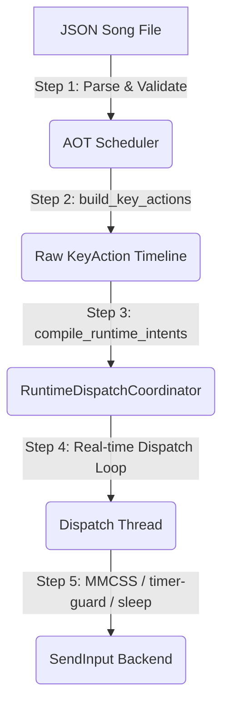

# System Architecture & Calibration

Sky Auto Player is built on a modern, strictly-layered **Domain-Driven Design (DDD)**. The architecture separates the abstract concept of music from the harsh, real-time realities of OS thread scheduling and game engine polling constraints.

---

## 1. High-Level Architecture

The codebase is divided into four distinct layers:

1. **Domain (`sky_music/domain/`):** Pure Python, zero side-effects. Contains immutable models (`Song`, `Note`), the strict JSON parser, and the Ahead-Of-Time (AOT) microsecond [scheduler](../src/sky_music/domain/scheduler.py). Domain returns primitives across the layer boundary: `PlaybackSessionContext.resolve_effective_policy` and `resolve_sleep_policy` return `(calibrated_margin_us, source_label)` and `(spin_threshold_us, poll_s)` respectively, leaving materialisation of `SleepPolicy` to the orchestration caller.
2. **Orchestration (`sky_music/orchestration/`):** The real-time heart of the app. Contains the `PlaybackEngine` (which consumes the timeline), the [RuntimeDispatchCoordinator](../src/sky_music/orchestration/runtime_dispatch.py#L133) (which manages key generations and anchor timing), and the telemetry/calibration modules. Orchestration resolves the device-calibrated margin via `infrastructure.calibration_loader.load_calibrated_margin_recommendation` once at session build time and constructs `SleepPolicy` from the domain primitives.
3. **Infrastructure (`sky_music/infrastructure/`):** Bridging code. Includes window focus tracking, hotkey listeners, real-time sleeper utilities, MMCSS registrations, and the device-calibration loader (`.cache/input_latency.json` consumer). May import `platform/` but must not be imported by `domain/`.
4. **Platform (`sky_music/platform/win32/`):** OS-specific implementations. Translates abstract actions into `SendInput` API calls using physical hardware scan codes. The only place Win32 ctypes may live.

> **Composition-root exception (review of main@7c548527 §"Governance mismatch của 4-layer DDD").**
> The strict layering above is enforced at the `domain/` and orchestration **core** boundaries
> by `tests/test_core_boundary.py` (no `import` of `sky_music.platform.*`, `sky_music.ui.*`, or
> `sky_music.infrastructure.focus` may appear under `orchestration/core/`). The composition-root
> modules — `orchestration/engine.py` (`PlaybackEngine`) and
> `orchestration/playback_supervisor.py` (`PlaybackSupervisor`) — are the ONE place where
> `platform.win32.inputs` is imported back across the layer boundary, and only to wire
> platform-owned handles through the injected ports/closures that the dispatch core consumes:
> the high-resolution waitable timer, the command auto-reset event (`create_auto_reset_event` /
> `set_event` / `close_handle`), the cheap HWND-only foreground probe
> (`is_foreground_cached_hwnd`), and the unfocused-send / diagnostics-log hooks. This is a
> deliberate dependency-injection seam — the composition root owns lifecycle and forwards
> platform access by injection, so `orchestration/core/` (the real-time loop, coordinator,
> state, ports) stays platform-free. `infrastructure/` already imports `platform/` under the
> same rationale (backend glue, real-time sleeper, focus guard). Other orchestration modules
> must not grow a direct `platform/` import; widening the exception would belong in
> `infrastructure/` or a dedicated bootstrap module instead.

---

## 2. The Playback Pipeline

The journey from a JSON file to a piano sound in-game follows a strict pipeline:


```mermaid
graph TD
    A[JSON Song File] -->|Step 1: Parse & Validate| B(AOT Scheduler)
    B -->|Step 2: build_key_actions| C(Raw KeyAction Timeline)
    C -->|Step 3: compile_runtime_intents| D(RuntimeDispatchCoordinator)
    D -->|Step 4: Real-time Dispatch Loop| E(Dispatch Thread)
    E -->|Step 5: MMCSS / timer-guard / sleep| F(SendInput Backend)
```

### Step 1: Parsing & Resolution
The parser reads the JSON file, strictly validating timestamps and schemas. Unmapped keys or negative timestamps instantly halt execution with clear errors. Keys are resolved into physical **Scan Codes** (ignoring OS keyboard language layouts).

### Step 2: The AOT Scheduler (`build_key_actions`)
Instead of calculating delays on the fly, the entire song is mapped out onto an absolute timeline in **microseconds** *before* playback begins.
* **Tempo Scaling:** All timestamps are scaled by `tempo_scale` and converted to microseconds.
* **Visibility Hold (`min_hold_us`):** Each note is held down long enough to survive the game's per-frame input sampling. With FPS selected, built-in frame-model holds materialize as `round(profile_frames * frame_us) + min_hold_margin_us`, where `frame_us = ceil(1_000_000 / fps)` and the profile margin defaults to 500 µs. Explicit `_us` overrides remain absolute; unframed fallbacks do not add the margin.
* **Same-Key Feasibility:** If the same key repeats faster than the target hold, the previous hold is compressed down to `min_hold_us`. If the authored interval is below `min_hold_us`, the repeat is physically infeasible: `strict` mode rejects and recommends a slower tempo, while `degraded` mode keeps `min_hold_us` and schedules the down events, which will be resolved at runtime.

### Step 3: Runtime Intent Compilation
Before playback starts, the raw `KeyAction` timeline is passed to [compile_runtime_intents](../src/sky_music/orchestration/runtime_dispatch.py#L85), which attaches stable, incrementing generation IDs to every down-up action pair. This yields a structured `RuntimeSchedule`.

### Step 4: The Real-Time Dispatch Loop
The `PlaybackEngine` feeds this schedule into the [RuntimeDispatchCoordinator](../src/sky_music/orchestration/runtime_dispatch.py#L133) and runs a dedicated dispatch thread. 
* **Completion Anchor:** To protect key-down visibility against OS injection latency, the coordinator calculates release limits dynamically:
  ```text
  release_not_before_ticks = down_dispatch_completed_ticks + min_hold_ticks
  effective_release_ticks = max(scheduled_release_ticks, release_not_before_ticks)
  ```
  Authored/configuration values are expressed in microseconds at the Python/API boundary;
  the native worker converts them once to checked QPC-derived tick durations. Scheduling,
  pause/recovery, minimum-hold and deadline decisions remain in typed ticks.
* **Conflict Resolution:** The compiler rejects authored same-key overlap. In the production Rust worker, any unexpected runtime conflict is an invariant failure: authored dispatch stops, cleanup runs, and the session ends in `error`; it is never converted into a successful drop. The configured `degraded`/`drop_chord` policies are retained only for the explicit Python diagnostic/oracle rollback path.

### Step 5: High-Precision Scheduling & Thread Hardening
To achieve microsecond accuracy on Windows, the dispatch thread employs:
1. **MMCSS Registration:** Elevates the thread's scheduling priority using Windows Multimedia Class Scheduler Service (MMCSS).
2. **Timer-Guard:** Utilizes a high-resolution waitable timer scope (1ms resolution) to prevent long scheduler sleeps from drifting.
3. **Precise Sleeper:** Wakes up early using coarse sleeps, yields using `sleep(0)`, and busy-waits (spins) for the final `spin_threshold_us` to hit deadlines precisely.

### Step 6: Native Rust Dispatch Engine (`sky_player_rs`)
Under Python 3.14 free-threaded (no-GIL), the production dispatch path executes the hot loop directly inside the native Rust workspace:
* **Workspace Structure:** `crates/sky_dispatch_core` (pure Rust domain logic, `#![forbid(unsafe_code)]`), `crates/sky_dispatch_win32` (Windows `SendInput`, QPC clock, MMCSS, Waitable Timer, Sleeper), and `crates/sky_player_rs` (PyO3 FFI extension with `#[pyo3::pymodule(gil_used = false)]`).
* **Native Thread Loop (`DispatchSession`):** A dedicated OS thread solely owns the Rust coordinator, estimator, waitable timer, command event, MMCSS/thread-priority and EcoQoS guards, tracked-key backend, and bounded telemetry buffer. Python only pushes commands/focus and pulls snapshots/results after crossing `orchestration/native_dispatch.py`.
* **Current rollout:** `dispatch_backend` (`auto`, `rust`, `python`) and `fidelity_mode` (`normal`, `strict`) are independent policies. `auto` prefers Rust for the eligible real Windows sender path; `rust` is an explicit fail-closed requirement and `python` is a diagnostic oracle. `SKY_USE_PYTHON_DISPATCH=1` remains a temporary rollback override. Missing or incompatible native metadata fails closed before playback. The selected backend, reason, probe result and fidelity mode are surfaced in runtime telemetry.
* **Lifecycle:** Commands wake an auto-reset event (event handle index 0, timer index 1), pause/focus paths release before coordinator cancellation, panic performs a full-instrument release, worker panics are contained, and a join timeout permanently poisons the session without dropping live handles.
* **Failure presentation:** A native worker exception or controlled Rust timing error is returned to the playback card as an error result after cleanup; the picker app remains open and shows the diagnostic. Only an explicit quit command returns the `quit` result that closes the playback app.
* **Command semantics:** Manual pause/resume is latest-wins atomic state plus an interrupt signal; it is not replayed from the bounded edge-command queue. Terminal commands retain monotonic atomic flags so queue saturation cannot undo the latest pause state.
* **Packaging gate:** release CI builds the exact version-specific wheel, installs it into the active test/build interpreter, verifies it again there, and only then runs Python tests/PyInstaller. The wheel gate requires a clean checkout and, when present, an exact `GITHUB_SHA`/`git HEAD` match. `build_app.py` embeds the exact release build ID and native-source fingerprint in the frozen Python package. Source checkouts compare native files and schema/ABI through that fingerprint, so Python/UI/docs edits do not invalidate a compatible wheel while native contract edits do. A missing frozen metadata module fails closed. The frozen executable runs `--selftest-rust` through the production probe and completes a mock worker without emitting real input.
* **Diagnostics:** `--doctor` reports native availability, enabled state, Rust core/rustc/PyO3 versions, `cp314t` ABI, schema, and build commit. Production exports only `DispatchSession` and build metadata; the tracked-key `RustInputBackend` is diagnostic-feature gated. Native telemetry retains a bounded fixed-size tick record (`RtTraceRecord`); outcome names and microsecond projections are materialized after the worker joins.

---

## 3. Playback Robustness & Hardening
To prevent input loss, stuck keys, and timing drift:
* **Per-Play Window Re-acquire:** On play start, the engine re-acquires the active window handle for the game to ensure input is sent to the correct target.
* **Active State Tracking:** The backend tracks all physically depressed keys in a 15-bit instrument mask. If a duplicate down command is sent for an already-held key, the backend filters it out to prevent queue clutter without hash-table work.
* **Release-first suspend lifecycle:** The native worker releases and verifies physical keys before calling `coordinator.cancel_live_generations()`. This cancels only `Active` and `ReleasePending` generations, clears live masks, and preserves future `Scheduled` generations and the authored cursor across resumable focus loss or manual pause. `cancel_all()` remains reserved for terminal quit/skip/error/panic/termination paths.
* **Dual-release on focus transitions:** When Sky loses foreground the dispatch thread releases tracked keys and freezes the timeline using QPC ticks; when Sky regains focus it performs a second idempotent release verification while foreground before resuming future scheduled work. A release failure or inconclusive verification is terminal and cannot be hidden by cleanup.
* **Partial note-on chord integrity (G5):** If `SendInput` returns `sent == n` for a musical note-on, the chord is committed. A zero-progress result may retry the **whole chord** once, immediately and without sleep. Any partial insertion makes the **whole requested chord uncertain**; production never infers a sent prefix or dispatches a remainder. It sends Up for the whole chord, verifies cleanup (falling back to full-instrument cleanup when needed), and ends playback through a controlled integrity error.
* **Failed note-off ownership:** A pending release is not discarded when `SendInput` makes no progress. The platform seam performs at most one immediate remainder retry; all delayed retry/backoff (`2/5/10/20 ms`, up to eight attempts) is coordinator-owned and interruptible. Exhaustion enters error recovery and performs full-instrument release before cancellation. Same-key downs remain blocked while that release is pending.
* **Release recovery timeline:** While a failed release is retrying, authored dispatch is held behind the pending release. After successful recovery, an O(1) immutable playback-clock offset advances the effective authored timeline, so same-key work is sent after release without an overdue catch-up burst or an O(N) schedule rewrite.
* **Release telemetry:** Note-off outcomes distinguish complete, partial, and failed sends (including deferred variants), and release lateness is measured from SendInput completion so retry and syscall time are included. Win32 values are observed diagnostics, not a guaranteed causal classification.
* **Multi-Pass Emergency Release:** `release_all()` runs a 3-pass verification using `GetAsyncKeyState` so keys reliably bounce back up against OS-queue blocking.

---

## 4. Telemetry & Auto-Calibration

### Telemetry Logs
Running with the `--debug-csv` flag dumps detailed metrics for every event:
* `lateness_us`: The difference between scheduled time and actual send time.
* `send_duration_us`: Time taken by the `SendInput` OS call.
* `observed_hold_us`: The actual duration the key was held, measured from down dispatch completion to up dispatch completion.

### Calibration Loop
Calibration is a host-side input-delivery measurement, not a game/audio-onset measurement. A
dedicated `native_calibration.exe` process creates the app-owned Win32 calibration window, injects
strictly through `SendInput`, and correlates the window's `WM_INPUT` receipt with native-call
completion. The player process does not modify its own Raw Input registration. Only complete,
anomaly-free samples contribute to quantiles; cleanup or process failures are unsuccessful
calibration. The current native output is schema version 8 / measurement protocol 3. Measured bucket
admission is based on the actual QPC idle gap between the previous exact SendInput completion and
the current exact SendInput entry; requested sleep duration is not evidence. Validated evidence
is stored in `.cache/input_latency.json` with the `injected_raw_input_delivery_proxy` label and
must carry the exact Git SHA, native build SHA, native source fingerprint, toolchain, Windows/QPC
provenance, and verified cleanup result.
Each native child is bounded by a total QPC budget in the inclusive range 6–120 seconds; five
seconds are reserved for native cleanup, leaving at least one second for measurement. Full
orchestration separately reserves five seconds for publication, rejects a requested budget below
11 seconds before preflight side effects, and uses an absolute global deadline. The only acceptance matrix is 1/5/15 × Down/Up × Hot/Cold, with 20 clean samples and
four warmups per bucket. Every bucket is isolated, cleanup-verified, and bounded. Stable-window
early stopping is not yet an acceptance claim; the current runner records the configured bounded
sample set.

Calibration artifacts retain aggregate counters/quantiles, the worst 16 samples, and every
anomalous sample. They never contain the complete raw sample stream. `--resume` accepts a bucket
only when the exact Git SHA, native build ID, native source fingerprint, clean-worktree state,
Rust toolchain, host fingerprint, schema/protocol, and configuration all match. A mismatch
rejects the checkpoint; it is never silently reused.

Diagnostic mode runs one requested bucket with a caller-selected sample count, prints native
progress, and writes either an ineligible bucket artifact or an always-written failure report
with kind, class, polyphony, sample index, phase, exact error, Win32 error, and cleanup state.
Diagnostic artifacts have `acceptance_eligible = false` and cannot be consumed by the finalizer.
The finalizer requires the configured 12 buckets, at least 20 clean attempts in every bucket,
identical provenance, and successful cleanup everywhere before writing the trusted
`.cache/input_latency.json`; the runner and checkpoint writer never write that cache.

A timeout kills and reaps only the current native chunk process and preserves prior checkpoint
artifacts. `--timeout-seconds` is an explicit, finite positive override for controlled runs and
can never exceed the 120-second process budget. Full orchestration requires at least 11 seconds
for the publication reserve plus one minimally measurable native child; that lower bound does not
guarantee completion of the full matrix.
